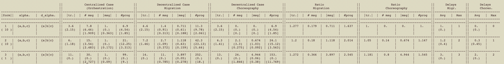
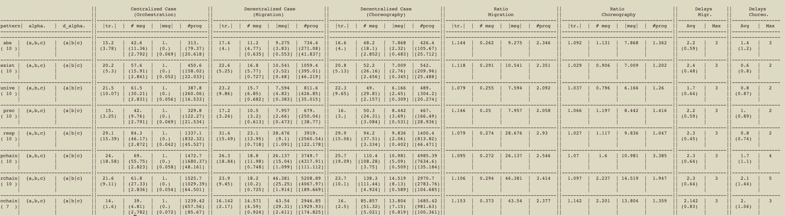

# Decent: an OCaml Benchmark for Decentralised Enforcement of LTL Formulae

Current Version: 3.1.

---

## 1 Description

### Overview

Decen is an OCaml Benchmark for Decentralized Enforcement of LTL formulae.
Dcent is written in the functional programming language OCaml.

For a full description of the underlying algorithms and principles, we refer the reader to the following conference publication:
> * Florian Gallay, Yliès Falcone:
Decentralized LTL Enforcement, GandALF 2021

Earlier versions of the benchmark were released (only featuring verification) with the following publications:
> * Andreas Bauer, Yliès Falcone:
Decentralised LTL monitoring. Formal Methods in System Design 48(1-2): 46-93 (2016)
> * Christian Colombo, Yliès Falcone:
Organising LTL monitors over distributed systems with a global clock. Formal Methods in System Design 49(1-2): 109-158 (2016)
> * Andreas Klaus Bauer, Yliès Falcone:
Decentralised LTL Monitoring. FM 2012: 85-100
> * Christian Colombo, Yliès Falcone:
Organising LTL Monitors over Distributed Systems with a Global Clock. RV 2014: 140-155

Decent takes as input:
- some LTL formulae to be enforced or some LTL Specification patterns (see the Specification Patterns Website);
- some traces against the formulae are enforced; an architecture given by a distributed alphabet indicating how components are organised and distributed in the system.

Note that the two inputs (formulas and traces) are not mandatory. One can simply indicate a size for a formula that will be automatically generated. Similarly, a size can be indicated for a trace to be automatically generated.
The syntax for giving distributed alphabets or specific formulas as input is given in Appendix A.

Decent then outputs some enforcement statistics such as the number of messages exchanged by the local monitors and the size of the main internal structure used to compute corrections.

LTL formulae are enforced using three different algorithms:
1. by using both decentralised approach we introduced (see the full paper for more details), i.e. each trace is read by a separate monitor, and
2. by using a "centralized" orchestration-based algorithm: we merge the traces to a single, global trace and then use a “central monitor” for the formula (i.e., all local monitors send their respective events to the central monitor who makes the decisions regarding the trace).

## 2 Requirements

Decent requires GNU Make, [OCaml](https://ocaml.org) and a few OCaml extensions which can be easily installed with [opam](https://opam.ocaml.org).
Additional required packages are:
  - oasis
  - camlp4
  - batteries
  - ocamlbuild
  - ocamlfind

Decent has been built in May 2022 with OCaml 4.08.1. Later versions of OCaml seem not compatible with camlp4.

## 3. Installation

If you wan to try Decent without installing it, you can use a Docker file allowing to build a Docker image and run Decent within a container.

Otherwise, in Section 3.2, you can find instructions to install Decent on your machine.

### 3.1 Installation with Docker

In directory `docker`, there is a Dockerfile to build a docker image.
Once you have Docker and GNU make installed on your machine, simply run:
```
make docker
```
This may take a few minutes (depending on the images that will be downloaded).
Then to run the container, and compile Decent, run:
```
make run
```
Within the container, if you modify the source files (in src/), and need to recompile Decent, run:
```
ocaml setup.ml -build
```

### 3.2 Installation on your machine


Otherwise, to install DecenMon, please follow the below steps.

1. [Install OPAM](https://opam.ocaml.org/doc/Install.html).
2. Install a C compiler (to install OCaml).
3. [Install OCaml](https://ocaml.org/docs/install.html).
4. [Configure oasis](https://ocaml.org/learn/tutorials/setting_up_with_oasis.html).
For this, the current oasis configutation file is used:
```
OASISFormat: 0.4
Name:        Decent
Version:     3.1
Synopsis:    Decentralised Monitoring of LTL formulae
Authors:     Ylies Falcone, Univ. Grenoble Alpes, Inria
License:     GPL-3

Executable decent
  Path:       src
  BuildTools: ocamlbuild
  MainIs:     decent.ml
  CompiledObject: best
  BuildDepends: batteries, camlp4
```
- `OASISFormat` should be left as is;
- `Name`, `Version`, `Synopsis`, `Authors` and `Licence` are for information purposes
- `Path`indicates the relative path to the directory containing the source files
- `BuildTools` should be left as is
- `MainIs` indicates the main file (entry point of the compilation process)
- `CompileObject` indicates whether to compile in bytecode or native format. It can take the values `bytecode` (compile in bytecode), `native` (compile in native) or `best` (compile in native if possible otherwise in bytecode).

The provided configutation can left as is or you can amend the file as per your needs.

5. Run the Make install target: 
```
make install
```
6. If you modify the source files (in src/), you can recompile Decent by running the Make Decent target: 
```
make Decent
```
## 4 Running Decent

To run the benchmark, it is simply needed to run the executable file "decent" (either native or bytecode) with appropriate options.
Different kinds of benchmarks are implemented. Options required for each kind are described below.

To perform enforcement, the option `-enforce true` is required.
We recall the different benchmarks available for monitoring in Appendix B.

### Benchmarking randomly generated LTL formulae

In this form of benchmark, one indicates either a specific size for the formulae or a maximum size for the formulae to be tested. Those cases correspond to options:
- `-sf [integer>0]` to indicate a specific size,
- `-msf [integer>0]` to indicate a maximum size.

In the later case, Decent will run benchmarks for each formula size from 1 to the desired size. Note that the size of formulae is measured in Decent in terms of operator entailment inside the formula. This choice, made after some experiments, reflects the intuitive idea that decentralized monitoring becomes heavier when operator entailment grows (instead of the number of symbols, for example).

Then several other options are mandatory:
- `-n [integer>0]` to indicate the number of formulae to be enforced for each formula size,
- `-st [integer>0]` to indicate the size of the trace against which formulae will be enforced,
- `-dalpha [string_representation_of_a_distributed_alphabet]` to indicate the distributed alphabet to consider during the benchmark (See Section input formats).

### Benchmark for LTL specification patterns

In this benchmark, one indicates one or several LTL specification patterns to be tested (see the [Specification pattern Website](http://patterns.projects.cis.ksu.edu/)). For convenience, the various kinds of formulae for each LTL specification patterns are recalled in Appendix C. The options used to select patterns are:

- `-abs [boolean]`: to select the *Absence* specification pattern for testing when the boolean is true;
- `-exis [boolean]`: to select the *Existence* specification pattern for testing when the boolean is true;
- `-univ [boolean]`: to select the *Universality* specification pattern for testing when the boolean is true;
- `-prec [boolean]`: to select the *Precedence* specification pattern for testing when the boolean is true;
- `-resp [boolean]`: to select the *Response* specification pattern for testing when the boolean is true;
- `-prec [boolean]`: to select the *Precedence* specification pattern for testing when the boolean is true;
- `-precc [boolean]`: to select the *Precedence Chain* specification pattern for testing when the boolean is true;
- `-respc [boolean]`: to select the *Response Chain* specification pattern for testing when the boolean is true;
- `-consc [boolean]`: to select the *Contrained Chain* specification pattern for testing when the boolean is true.

Not mentioning a specification patterns amounts to setting its Boolean flag to false.

Similarly, several other options are mandatory:
- `-n [integer>0]` to indicate the number of formulae to be enforced for each formula size,
- `-st [integer>0]` to indicate the size of the trace against which formulae will be enforced,
- `-dalpha [string_representation_of_a_distributed_alphabet]` to indicate the distributed alphabet to consider during the benchmark (See Section input formats).

### Benchmark for specific formulas

It is also possible to give specific formulas as input by writing them in a file and then using the following options:
-`-specific_f [filename]`: parses the formulas in the given file to enforce them against a randomly generated trace.
-`-nf [integer>0]`: specifies the number of formulas contained in the file.

As in the previous two benchmarks, the following other options are mandatory:
- `-n [integer>0]` to indicate the number of formulae to be enforced for each formula size,
- `-st [integer>0]` to indicate the size of the trace against which formulae will be enforced,
- `-dalpha [string_representation_of_a_distributed_alphabet]` to indicate the distributed alphabet to consider during the benchmark (See Section input formats).

### Benchmark for multiple specific system architectures

Similarly to the previous one, it is possible to give multiple distributed alphabets as input by writing them in a file, each representing a different architecture of the system.
The options used for this benchamrk are:
-`-multi_dalpha [filename]`: parses the distributed alphabets in the given file and performs the enforcement for each of them.
-`-n_alpha [integer>0]`: specifies the number of distributed alphabets in the file.

Other options are also mandatory:
- `-n [integer>0]` to indicate the number of formulae to be enforced for each formula size,
- `-st [integer>0]` to indicate the size of the trace against which formulae will be enforced,

### Combining benchmarks
It is possible to perform multiple benchmarks at the same time.

For example, we can enforce 10 formulas of size 5 on traces of size 5 and then using the *Absence* patterns with the following command:
```
./decent.native -enforce true -n 10 -st 5 -sf 5 -abs true -dalpha "{a1,a2|b1,b2|c1,c2}"
```

It is also possible to combine benchmarks.
For example to enforce 10 formulas generated from the *Precedence* pattern on traces of size 20 on three different systems, we can do (where `filename` contains three distributed alphabets):
```
./decent.native -enforce true -n 10 -st 20 -prec true -multi_dalpha filename -n_alpha 3
```

### Other options
There are also other options available:
-`flipcoin`, `bias`, `expo` and `beta` are used to pick which probability distribution is used when generating the traces (`flipcoin is used by default`).
-`-bias` causes the generated formulas to favor one component.
-`-eval` performs enforcement once with every distributed alphabets that can be generated from the given alphabet. Note that for this option, `-alpha [string_representation_of_an_alphabet]` is a mandatory option (replacing `-dalpha`)

By default, only the full statistics over all the enforced formula will be displayed.
By using `-prt_full_stats [boolean]`, it is possible to display the statistics of every run individually.

Finally, it is also possible to store the results in a file using `-keep_samples [boolean]`. By default, the file used is called `RESULTS_ENF.txt` but it is possible to use another one using `-file [filename]`.
When storing the results, the output displayed on the terminal is also stored in the file `STATS_RESULTS_ENF.txt`.

A full list of options is given in Appendix D.

## 5 Remarks about the tool
Some executions may take a very long time to finish (more than 10 minutes). This is more common on formulas of size >6 and in the third experiment on the larger systems. This is due to the explosion of formulas size in some cases (caused by the progression function). This happens when we generate some "bad" formulas, i.e. formulas containing several interleaved Until operators with Globally and/or Eventually operators (hence the fact that it is more common on larger formulas).

Also, when using the `prt_full_stats` option, some additional debugging informations are displayed in the full statistics.
One of them is the number of runs where enforcement was required. In some cases, the value may be different between the three algorthims.
This is mainly due to the fact that the simplification function is not powerful enough to fully simplify some formulas that are equivalent to False.
Because of this, the local algorithm may be led to pick an event that leads to a violation and send it to the next enforcer (which cannot happen in the global version as the whole memory is send to the next enforcer each time).

Also, we have implemented some oracles to verify that the traces by the global (global enforced trace) and the centralized algorithm are equal and that the trace produced by the local algorithm (local enforced trace) is valid.
Oracle-related messages are also only displayed when the aforementionned option is used and, in some cases, a messages says that the local enforced trace cannot be verified.
To verify it, we check that each emitted event was one of the possible alternative computed in the global algorithm (as the global version explores every possible alternative).
The problem is, we cannot guarantee that both decentralized version will emit the same events and, consequently, as the properties to enforce evolve over time (the next formula to enforce depends on the emitted event), we may reach a state where the constraints given by the formula to enforce are quite different between both versions making it impossible to check this way.
Because we did not want the oracle to be too expensive, we have not implemented additional checks to verify these cases yet.

## Appendix A: Input formats

We describe below some input formats that shall be used when submitting inputs for benchmark to Decent.

### Formulas

We give a list of the supported operators as well as the syntax for the parser:
- True: `True`
- False: `False`
- Negation: `!`
- And: `&`
- Or: `|`
- Implication: `->`
- Equivalence: `<->`
- Next: `X`
- Globally: `G`
- Eventually: `F`
- Until: `U`
- Previous (monitoring only): `Y`

Atomic propositions are strings of letters and digits. Formulas should be heavily parenthesized and an example of two formulas specified on the alphabet `{g1,y1,r1|g2,y2,r2|g3,y3,r3|g4,y4,r4}` is given in the file `formulas_traffic_light`.

### Distributed alphabet

They are represented by a quoted string. Distributed alphabets are delimited by curly braces. Inside a distributed alphabet the symbol `|` (resp. `,`) is used to indicate component separation (reps. separate symbols inside a component).
For instance `{a1,a2|b1,b2|c1,c2}` denotes a 3-component architecture. On component 1 (reps. 2,3), the local alphabet contains symbols a1 and a2 (resp. b1 and b2, c1 and c2).

An example of file containing multiple distributed alphabets is given in `scripts/enforcement/experiment_3/alphabets`. 

### Appendix B: Decentralized Monitoring

To perform monitoring, use the option `-enforce false` (or omit `-enforce` entirely).

The inputs and outputs are the same (although the statistics used to evaluate the approaches are not exactly identical).

In this case, LTL formulae are analysed in two different modes:
1. by using the decentralised approach described above (i.e., each trace is read by a separate monitor), and
2. by merging the traces to a single, global trace and then using a “central monitor” for the formula (i.e., all local monitors send their respective events to the central monitor who makes the decisions regarding the trace).

For more details on these approaches (either theoretical or on the results obtained with the benchmark), refer to the publications associated with earlier versions of the benchmark. 

The first two benchmarks mentioned previously are supported (randomly generated formulas and specification patterns) and the following options can be used to choose the metrics and statistics to display:
- `-prt_full [bool]` to indicate that all statistics (number of messages, trace lengths and their ratio, but also the maximal and average delay) shall be displayed,
- `-prt_trace_mess [bool]` to indicate that trace and number of messages statistics") shall be displayed,
- `-prt_delay [bool]` to indicate that delay statistics shall be displayed.

Refer to appendix D for a more detailed list of options.

### Appendix C: LTL Specification Patterns

The following patterns come from the [Specification Pattern Website](http://patterns.projects.cis.ksu.edu/documentation/patterns/ltl.shtml) (for LTL formulae).

#### Absence

P is false :
- Globally:	`[](!P)``
- Before R: `<>R -> (!P U R)`
- After Q: `[](Q -> [](!P))`
- Between Q and R: `[]((Q & !R & <>R) -> (!P U R))`
- (*) After Q until R: `[](Q & !R -> (!P W R))`

#### Existence

P becomes true :
- Globally: `<>(P)`
- (*) Before R: `!R W (P & !R)`
- After Q: `[](!Q) | <>(Q & <>P))`
- (*) Between Q and R: `[](Q & !R -> (!R W (P & !R)))`
- (*) After Q until R: `[](Q & !R -> (!R U (P & !R)))`

#### Bounded Existence

In these mappings, we illustrate one instance of the bounded existence pattern, where the bound is at most 2 designated states. Other bounds can be specified by variations on this mapping.

Transitions to P-states occur at most 2 times:
- Globally: `(!P W (P W (!P W (P W []!P))))`
- Before R:
```
<>R -> ((!P & !R) U (R | ((P & !R) U
         (R | ((!P & !R) U (R | ((P & !R) U
            (R | (!P U R)))))))))
```
- After Q: `<>Q -> (!Q U (Q & (!P W (P W (!P W (P W []!P))))))`
- Between Q and R:
```
[]((Q & <>R) ->
   ((!P & !R) U (R | ((P & !R) U
     (R | ((!P & !R) U (R | ((P & !R) U
       (R | (!P U R))))))))))
```
- After Q until R:
```
[](Q -> ((!P & !R) U (R | ((P & !R) U
          (R | ((!P & !R) U (R | ((P & !R) U
            (R | (!P W R) | []P)))))))))
```
#### Universality

P is true:
- Globally: `[](P)`
- Before R: `<>R -> (P U R)`
- After Q: `[](Q -> [](P))`
- Between Q and R: `[]((Q & !R & <>R) -> (P U R))`
- (*) After Q until R: `[](Q & !R -> (P W R))`

#### Precedence

S precedes P:
- (*) Globally: `!P W S`
- (*) Before R: `<>R -> (!P U (S | R))`
- (*) After Q: `[]!Q | <>(Q & (!P W S))`
- (*) Between Q and R: `[]((Q & !R & <>R) -> (!P U (S | R)))`
- (*) After Q until R: `[](Q & !R -> (!P W (S | R)))`

#### Response

S responds to P :
- Globally: `[](P -> <>S)`
- (*) Before R: `<>R -> (P -> (!R U (S & !R))) U R`
- After Q: `[](Q -> [](P -> <>S))`
- (*) Between Q and R: `[]((Q & !R & <>R) -> (P -> (!R U (S & !R))) U R)`
- (*) After Q until R: `[](Q & !R -> ((P -> (!R U (S & !R))) W R)`

#### Precedence Chain

The following illustrates the 2 cause-1 effect precedence chain.

S, T precedes P:
- Globally: `<>P -> (!P U (S & !P & o(!P U T)))`
- Before R: `<>R -> (!P U (R | (S & !P & o(!P U T))))`
- After Q: `([]!Q) | (!Q U (Q & <>P -> (!P U (S & !P & o(!P U T))))`
- Between Q and R: `[]((Q & <>R) -> (!P U (R | (S & !P & o(!P U T)))))`
- After Q until R: `[](Q -> (<>P -> (!P U (R | (S & !P & o(!P U T))))))`

The following illustrates the 1 cause-2 effect precedence chain.

P precedes (S, T):
- Globally: `(<>(S & o<>T)) -> ((!S) U P))`
- Before R: `<>R -> ((!(S & (!R) & o(!R U (T & !R)))) U (R | P))`
- After Q: `([]!Q) | ((!Q) U (Q & ((<>(S & o<>T)) -> ((!S) U P)))`
- Between Q and R: `[]((Q & <>R) -> ((!(S & (!R) & o(!R U (T & !R)))) U (R | P)))`
- After Q until R: `[](Q -> (!(S & (!R) & o(!R U (T & !R))) U (R | P) | [](!(S & o<>T))))`

#### Response Chain

##### 2 stimulus-1 response chain

P responds to S,T:
- Globally: `[] (S & o<> T -> o(<>(T & <> P)))`
- Before R: `<>R -> (S & o(!R U T) -> o(!R U (T & <> P))) U R`
- After Q: `[] (Q -> [] (S & o<> T -> o(!T U (T & <> P))))`
- Between Q and R: `[] ((Q & <>R) -> (S & o(!R U T) -> o(!R U (T & <> P))) U R)`
- After Q until R:
```
[] (Q -> (S & o(!R U T) -> o(!R U (T & <> P))) U
    (R | [] (S & o(!R U T) -> o(!R U (T & <> P)))))
```

##### 1 stimulus-2 response chain

S,T responds to P:
- Globally: `[] (P -> <>(S & o<>T))`
- Before R: `<>R -> (P -> (!R U (S & !R & o(!R U T)))) U R`
- After Q: `[] (Q -> [] (P -> (S & o<> T)))`
- Between Q and R: `[] ((Q & <>R) -> (P -> (!R U (S & !R & o(!R U T)))) U R)`
- After Q until R
```
[] (Q -> (P -> (!R U (S & !R & o(!R U T)))) U
    (R | [] (P -> (S & o<> T))))
```

#### Constrained Chain Patterns

The following is the 1-2 response chain constrained by a single proposition.

S,T without Z responds to P:
- Globally:	`[] (P -> <>(S & !Z & o(!Z U T)))`
- Before R: `<>R -> (P -> (!R U (S & !R & !Z & o((!R & !Z) U T)))) U R`
- After Q: `[] (Q -> [] (P -> (S & !Z & o(!Z U T))))`
- Between Q and R: `[] ((Q & <>R) -> (P -> (!R U (S & !R & !Z & o((!R & !Z) U T)))) U R)`
- After Q until R:
```
[] (Q -> (P -> (!R U (S & !R & !Z & o((!R & !Z) U T)))) U
    (R | [] (P -> (S & !Z & o(!Z U T)))))
```

## Appendix D: Complete List of Options

The list of all input options to Decent can be obtained by executing
```
Decent.ext --help
```
(where `ext` is either `.native` or `byte` depending on your compilation option)

The tags [Enf], [Mon] or [Mon/Enf] after each option indicates whether the option is supported for enforcement, monitoring or both (respectively).

- -`seed integer (<> 0)`: sets a seed [Enf]
- -`enforce [boolean]`: do enforcement instead of monitoring [Enf] 
- -`optimistic [boolean]`: use the "optimistic" mode (always compute the alternatives regardless of whether there is a violation or not)
- -`specific_f [filename]`: file containing specific formulas to enforce [Enf]
- -`nf [integer > 0]`: number of specific formulas to enforce given in the file [Enf]
- -`n [integer > 0]`: the maximum number of tests to run to obtain one row benchmark (each test can result in a meaningful sample or not, e.g., in the case of a non-monitorable formula) [Mon/Enf]
- -`sf [integer > 0]`: the size of the formula [Mon/Enf]
- -`msf [integer > 0]`: the maximum size of the formula (will test from size 1 to the value provided) [Mon/Enf]
- -`st [integer > 0]`: the size of the trace [Mon/Enf]
- -`dalpha [string]`: the decentralized alphabet [Mon/Enf]
- -`alpha [string]`: the centralized alphabet (will consider possible dalphabets generated from it) [Mon/Enf]
- -`multi_dalpha [filename]`: file containing multiples decentralized alphabet [Enf]
- -`n_alpha [integer > 0]`: number of decentralized alphabet given in the file [Enf]
- -`abs [boolean]`: use absence patterns [Mon/Enf]
- -`exis [boolean]`: use  existence patterns [Mon/Enf]
- -`bexis [boolean]`: use  bounded existence patterns [Mon/Enf]
- -`univ [boolean]`: use universality patterns [Mon/Enf]
- -`prec [boolean]`: use precedence patterns [Mon/Enf]
- -`resp [boolean]`: use response patterns [Mon/Enf]
- -`precc [boolean]`: use precedence chain patterns [Mon/Enf]
- -`respc [boolean]`: use response chain patterns [Mon/Enf]
- -`consc [boolean]`: use constrained chain patterns [Mon/Enf]
- -`prt_trace_mess [boolean]`: print trace and number of messages statistics [Mon]
- -`prt_delay [boolean]`: print delay statistics [Mon]
- -`prt_full [boolean]`: print full statistics [Mon]
- -`prt_debug [boolean]`: print debug infos about enforcement [Enf]
- -`flipcoin`: use the flipcoin probability distribution (uniform distribution with probability 0.5) [Mon/Enf]
- -`bernouilli [float]`: use the BERNOUILLI probability distribution (uniform distribution with a probability given as an argument) [Mon/Enf]
- -`expo [float]`: use the EXPONENTIAL probability distribution (the rate parameter is given as an argument) [Mon/Enf]
- -`beta [float float]`: use the BETA probability distribution (the rate parameters are given as arguments) [Mon/Enf]
- -`only_changes`: components send the value of their propositions only if there is a change in its value. More precisely, if among the monitors, there is at least the value of one proposition that is modified wrt the previous event, the component has to send a message to the monitor [Mon]
- -`bias`: bias the generation of formulae to favor one component [Mon/Enf] 
- -`precision [integer>0]`: precision of numbers (number of decimals) [Mon/Enf]
- -`eval`: uses every distributed alphabets that can be built from the given alphabet once [Mon/Enf]
- -`keep_samples [boolean]`: keep samples [Mon/Enf]
- -`prod_tex [boolean]`: produces additional output files containing results usable for a LaTeX table (requires keep_samples) [Enf]
- -`file [filename]`: file on which samples should be stored [Mon/Enf]
- -`nb_samples [integer>0]`: the number of target samples to obtain [Mon]
- -`help`  Display this list of options
- -`-help`  Display this list of options


We recommend having the value for option `-n` much larger than the value for option `nb_samples`.

## Appendix E: Examples

Examples should be executed at the root of the project (where the Decent executable is located).

### Benchmark with Random Formulae

The script `scripts/enforcement/experiment_1.sh` performs this benchmark.
It runs the following command (for the optimistic mode):
```
./decent.native -enforce true -n 1000 -st 100 -msf 6 -dalpha "{a1,a2|b1,b2|c1,c2}" -keep_samples true -seed $SEED -optimistic true 
```
The following options are used:
 - 1000 formulas of each size between 1 and 6 are generated
 - For each formula, a trace of size 100 is generated to be enforced
 - The system we are studying contains 3 components that can observe 2 atomic proposition each (represented by the alphabet {a1,a2|b1,b2|c1,c2})
 - The results are saved in `RESULTS_ENF.txt`
 - A seed is set for the random generation ($SEED contains a random value between 1 and 10000) that is generated beforehand. We do this because we want to enforce the same formulas/traces using both the pessimistic and optimistic mode to compare them.
 - The optimistic mode is used (this scripts also runs the same command without `-optimistic true` to run the same experiment with the pessimistic mode).

Another example for monitoring:
```
./decent.native -n 500 -nb_samples 10 -msf 3 -st 1000 -dalpha "{a|b|c}" -prt_full true -keep_samples true -file log.txt
```
it tells Decent to execute a benchmark with the following options:
- For each entry line, the maximum number of tests is: 500
- For each entry line, the target number of sample is: 10
- Running benchmarks for formulae of maximum size: 3 (i.e., it will do a complete bench for each formula size between 1 and 3)
- Each formula will be monitored against a freshly randomly generated trace of size: 1000
- The probability distribution that will be used for the trace is flipcoin
- Distributed alphabet used: {a|b|c}
- Full statistics will be displayed.
- Storing the results in `log.txt`

Decent will recall the selected options, run for a while and display the results as illustrated by the following screenshot.
One can consult `log.txt to look at the individual sample experiments.



### Benchmark with Specification Patterns

The script `scripts/enforcement/experiment_2.sh` performs this benchmark.
It runs the following command:
```
./decent.native -enforce true -n 1000 -st 100 -abs true -univ true -exis true -bexis true -prec true -resp true -precc true -respc true -consc true -dalpha "{a1,a2|b1,b2|c1,c2}" -keep_samples true -seed $SEED -optimistic true
```
The following options are used:
 - 1000 formulas are generated for each pattern: absence, universality, existence, bounded existence, precedence, response, precedence chain, response chain, constrained chain
 - For each formula, a trace of size 100 is generated to be enforced
 - The system we are studying contains 3 components that can observe 2 atomic proposition each (represented by the alphabet {a1,a2|b1,b2|c1,c2})
 - The results are saved in `RESULTS_ENF.txt`
 - A seed is set for the random generation ($SEED contains a random value between 1 and 10000) that is generated beforehand. We do this because we want to enforce the same formulas/traces using both the pessimistic and optimistic mode to compare them.
 - The optimistic mode is used (this scripts also runs the same command without `-optimistic true` to run the same experiment with the pessimistic mode).

Another example for monitoring:
```
/decent.native -n 500 -nb_samples 10 -abs true -exis true -univ true -prec true -resp true -precc true -respc true -consc true -st 1000 -dalpha "{a|b|c}" -prt_full true -keep_samples true -file log.txt
```
it tells Decent to execute a benchmark with the following options:
- For each entry line, the maximum number of tests is: 500
- For each entry line, the target number of sample is: 10
- The following LTL specification pattern(s) will be tested:  abscence  existence  universality  precedence  response  response_chain  precedence_chain  constrained_chain
- Each formula will be monitored against a freshly randomly generated trace of size: 1000
- The probability distribution that will be used for the trace is flipcoin
- Distributed alphabet used: {a|b|c}
- Full statistics will be displayed.
- Storing the results in `log.txt`

Decent will recall the selected options, run for a while and display the results as illustrated by the following screenshot.

One can consult `log.txt to look at the individual sample experiments.



### Further Examples

The script `scripts/enforcement/experiment_3.sh` runs a benchmark with different system architecture (which are given in `scripts/enforcement/experiment_3/alphabets`).

Directory `example_benchs` contains further monitoring examples.

### Monitoring examples from FMSD Papers

Scripts to run the examples from the FMSD paper

> * Christian Colombo, Yliès Falcone:
> Organising LTL monitors over distributed systems with a global clock. Formal Methods in System Design 49(1-2): 109-158 (2016)

are provided within the `example_benchs/fmsd_bench` directory.
